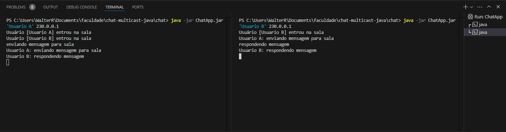

# chat-multicast-java
projeto de um chat para treinar e aprender a criar multcast entre Threads
# executando projeto
no diretorio chat rodar o segunte comando 
java -jar ChatApp.jar 'Usuario A' 230.0.0.1
sendo 'Usuario A' o nome do usuario e
sendo 230.0.0.1 o endereço da sala
# criando executando multiplas instancias
